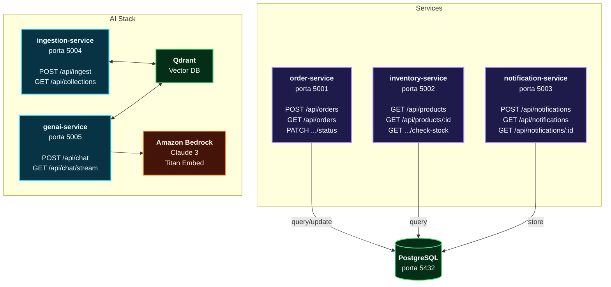

# OrderFlow — DevOps Pipeline Project

Piattaforma di gestione ordini basata su microservizi, utilizzata come progetto pratico per il corso DevOps.  
Copre l'intero ciclo: Code → Build → Test → Release → Deploy → Operate.

## Architettura




## Stack tecnologico

| Layer | Tecnologia |
|---|---|
| Linguaggio | Python 3.11 |
| Framework | FastAPI + Uvicorn |
| Database | PostgreSQL 15 |
| Container | Docker + Docker Compose |
| CI/CD | Jenkins |
| Registry | AWS ECR |
| Infrastruttura | Terraform |
| Orchestrazione | Kubernetes (EKS) |
| Cloud | AWS eu-central-1 |

## Struttura del repository

## Struttura del repository

```
corso-devops/
├── order-service/
│   ├── main.py
│   ├── requirements.txt
│   ├── Dockerfile
│   └── tests/
│       ├── __init__.py
│       └── test_order.py
├── inventory-service/
│   ├── main.py
│   ├── requirements.txt
│   ├── Dockerfile
│   └── tests/
│       ├── __init__.py
│       └── test_inventory.py
├── notification-service/
│   ├── main.py
│   ├── requirements.txt
│   ├── Dockerfile
│   └── tests/
│       ├── __init__.py
│       └── test_notification.py
├── ingestion-service/       # RAG: carica e indicizza PDF su Qdrant
│   ├── main.py
│   ├── pyproject.toml
│   ├── Dockerfile
│   ├── config/
│   ├── models/
│   ├── loaders/
│   ├── pipeline/
│   └── tests/
├── genai-service/           # RAG: chatbot con Claude su Bedrock
│   ├── main.py
│   ├── pyproject.toml
│   ├── Dockerfile
│   ├── config/
│   ├── models/
│   ├── retriever/
│   ├── chains/
│   ├── memory/
│   ├── api/
│   └── tests/
├── terraform/
├── k8s/
├── docker-compose.yml
├── docker-compose.test.yml
├── jenkinsfile
└── init-db.sql
```

## Avvio locale

### Prerequisiti

- Docker Desktop
- Python 3.11+
- AWS CLI (per le fasi ECR/ECS)

### Tutti i servizi con Docker Compose

```bash
# Avvia postgres + tutti e 3 i microservizi
docker-compose up -d

# Verifica che siano healthy
docker-compose ps

# Logs in tempo reale
docker-compose logs -f
```

### Endpoints disponibili dopo l'avvio

| Servizio | URL | Health check |
|---|---|---|
| order-service | http://localhost:5001 | http://localhost:5001/health |
| inventory-service | http://localhost:5002 | http://localhost:5002/health |
| notification-service | http://localhost:5003 | http://localhost:5003/health |

### Swagger UI

Ogni servizio espone la documentazione interattiva:

- http://localhost:5001/docs
- http://localhost:5002/docs
- http://localhost:5003/docs

### Eseguire i test localmente

```bash
# order-service
cd order-service
pip install -r requirements.txt
python -m pytest tests/ -v --cov=. --cov-report=term

# inventory-service
cd inventory-service
python -m pytest tests/ -v --cov=. --cov-report=term

# notification-service
cd notification-service
python -m pytest tests/ -v --cov=. --cov-report=term
```

### Test di integrazione

```bash
docker-compose -f docker-compose.yml -f docker-compose.test.yml run --rm integration-test
```

## Pipeline CI/CD

La pipeline Jenkins si attiva ad ogni push su `main` ed esegue questi stage in sequenza:
Checkout → Setup Tools → Validation → Build Images → Unit Tests → Integration Test → Push ECR → Verify ECR

| Stage | Descrizione |
|---|---|
| Checkout | Clona il repo e calcola `IMAGE_TAG` = `BUILD_NUMBER-GIT_SHA` |
| Setup Tools | Installa AWS CLI se non presente |
| Validation | Verifica che ogni servizio abbia `Dockerfile`, `requirements.txt`, `main.py` |
| Build Images | Build parallelo dei 3 Docker image (`linux/amd64`) |
| Unit Tests | pytest con coverage ≥ 50% per ogni servizio, in parallelo |
| Integration Test | Avvia stack completo con docker-compose, esegue test end-to-end |
| Push ECR | Push su AWS ECR solo da branch `main`, con tag `IMAGE_TAG` e `latest` |
| Verify ECR | Verifica che le immagini siano effettivamente presenti su ECR |

### Credenziali Jenkins richieste

| ID credenziale | Tipo | Contenuto |
|---|---|---|
| `aws-credentials` | Username/Password | AWS Access Key ID + Secret |
| `ecr-registry-url` | Secret text | URL del registry ECR |

## Ambienti

| Ambiente | Branch | Note |
|---|---|---|
| dev | qualsiasi | Build e test locali |
| staging | `main` | Push ECR + deploy su ECS staging |
| prod | tag `v*` | Deploy su EKS production |

## Struttura progetto (v2 — refactored)

La struttura è stata riorganizzata per separare chiaramente i tre livelli dell'infrastruttura DevOps:
```
OrderFlow_DevOps/
├── order-service/
├── inventory-service/
├── notification-service/
├── ingestion-service/                   # RAG: carica PDF su S3 → indicizza su Qdrant
├── genai-service/                       # RAG: chatbot Claude su Bedrock
│
├── terraform/                           # Infrastructure as Code
│   ├── modules/
│   │   ├── vpc/                        # VPC, subnet pubblici/privati, NAT Gateway
│   │   ├── security-groups/            # SG per EKS, RDS, ALB
│   │   ├── ecr/                        # 5 repository ECR per i microservizi
│   │   ├── rds/                        # PostgreSQL RDS
│   │   ├── eks/                        # EKS cluster + node group
│   │   ├── iam/                        # IRSA (IAM Roles for Service Accounts)
│   │   ├── bedrock-iam/                # Policy per invocare Bedrock (Claude, Titan)
│   │   └── s3-documents/               # S3 bucket per PDF da ingerire
│   ├── environments/
│   │   ├── dev/                        # main.tf collega tutti i moduli con var dev
│   │   ├── staging/                    # CIDR diversi, RDS multi-AZ
│   │   └── prod/
│   └── .gitignore
│
├── helm/                                # Package manager Kubernetes
│   ├── order-service/                   # Chart + values per dev/staging/prod
│   ├── inventory-service/
│   ├── notification-service/
│   ├── ingestion-service/               # CronJob invece di Deployment
│   └── genai-service/
│
├── k8s/                                 # Risorse cluster-wide
│   ├── namespaces/                      # dev, staging, prod
│   ├── monitoring/                      # Prometheus, Grafana, ServiceMonitors
│   └── qdrant/                          # Qdrant vector DB (Helm override)
│
├── docker-compose.yml
├── jenkinsfile
└── README.md
```

## Roadmap di implementazione — Completata ✅

- [x] **Fase ① CODE** — 5 microservizi Python/FastAPI con test unitari (coverage > 70%)
- [x] **Fase ② BUILD** — Dockerfile multi-stage per ogni servizio
- [x] **Fase ③ TEST** — Pipeline Jenkins con pytest parallelo su 5 servizi
- [x] **Fase ④ RELEASE** — Push immagini su AWS ECR (tag build number + git SHA)
- [x] **Fase ⑤ DEPLOY** — Terraform IaC: VPC, EKS, RDS, ECR, IAM, Bedrock, S3
- [x] **Fase ⑥ OPERATE** — Helm Charts per 5 servizi, K8s namespaces, monitoring ready

## Deployment workflow (nextgen)

```
Git push main
↓
Jenkins Pipeline
├─ Checkout + Build (parallelo: 5 servizi)
├─ Unit Tests (parallelo: 5 servizi, coverage ≥ 50%)
├─ Integration Test (docker-compose)
├─ Push ECR (main branch only)
└─ Verify ECR
↓
Terraform apply (dev/staging/prod)
├─ VPC + Subnet + NAT Gateway
├─ Security Groups
├─ EKS Cluster + Node Group
├─ RDS PostgreSQL
├─ ECR Repositories
├─ IAM Roles + IRSA
├─ Bedrock permissions
└─ S3 Documents Bucket
↓
Helm deploy (helm upgrade --install)
├─ order-service → Deployment + Service + HPA
├─ inventory-service → Deployment + Service + HPA
├─ notification-service → Deployment + Service + HPA
├─ ingestion-service → CronJob (ogni notte) + ServiceAccount (IRSA)
└─ genai-service → Deployment + Service + HPA + ServiceAccount (IRSA)
↓
Kubernetes Operate
├─ Auto-scaling (HPA via CPU)
├─ Health checks (liveness + readiness probes)
├─ Monitoring (Prometheus + Grafana + ServiceMonitors)
├─ Vector DB (Qdrant per RAG)
└─ Logging (CloudWatch + container logs)
```

## Prossimi step (post-MVP)

- [ ] Networking Ingress con ALB controller
- [ ] Service Mesh (Istio) per observability
- [ ] GitOps con ArgoCD per deployment automatici
- [ ] Cert Manager + HTTPS su Route 53
- [ ] Multi-region failover
- [ ] Cost optimization (spot instances, reserved capacity)

## Autore

Mirko Geria — [github.com/Mirkogeria](https://github.com/Mirkogeria)  
Corso DevOps — AWS · Docker · Jenkins · Terraform · Kubernetes
