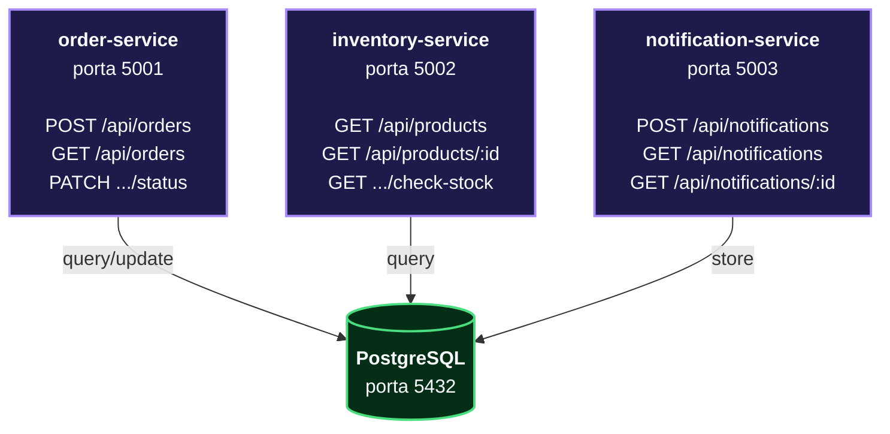

# OrderFlow — DevOps Pipeline Project

Piattaforma di gestione ordini basata su microservizi, utilizzata come progetto pratico per il corso DevOps.  
Copre l'intero ciclo: Code → Build → Test → Release → Deploy → Operate.

## Architettura




## Stack tecnologico

| Layer | Tecnologia |
|---|---|
| Linguaggio | Python 3.11 |
| Framework | FastAPI + Uvicorn |
| Database | PostgreSQL 15 |
| Container | Docker + Docker Compose |
| CI/CD | Jenkins |
| Registry | AWS ECR |
| Infrastruttura | Terraform |
| Orchestrazione | Kubernetes (EKS) |
| Cloud | AWS eu-central-1 |

## Struttura del repository

## Struttura del repository

```
corso-devops/
├── order-service/
│   ├── main.py
│   ├── requirements.txt
│   ├── Dockerfile
│   └── tests/
│       ├── __init__.py
│       └── test_order.py
├── inventory-service/
│   ├── main.py
│   ├── requirements.txt
│   ├── Dockerfile
│   └── tests/
│       ├── __init__.py
│       └── test_inventory.py
├── notification-service/
│   ├── main.py
│   ├── requirements.txt
│   ├── Dockerfile
│   └── tests/
│       ├── __init__.py
│       └── test_notification.py
├── terraform/
├── k8s/
├── docker-compose.yml
├── docker-compose.test.yml
├── jenkinsfile
└── init-db.sql
```

## Avvio locale

### Prerequisiti

- Docker Desktop
- Python 3.11+
- AWS CLI (per le fasi ECR/ECS)

### Tutti i servizi con Docker Compose

```bash
# Avvia postgres + tutti e 3 i microservizi
docker-compose up -d

# Verifica che siano healthy
docker-compose ps

# Logs in tempo reale
docker-compose logs -f
```

### Endpoints disponibili dopo l'avvio

| Servizio | URL | Health check |
|---|---|---|
| order-service | http://localhost:5001 | http://localhost:5001/health |
| inventory-service | http://localhost:5002 | http://localhost:5002/health |
| notification-service | http://localhost:5003 | http://localhost:5003/health |

### Swagger UI

Ogni servizio espone la documentazione interattiva:

- http://localhost:5001/docs
- http://localhost:5002/docs
- http://localhost:5003/docs

### Eseguire i test localmente

```bash
# order-service
cd order-service
pip install -r requirements.txt
python -m pytest tests/ -v --cov=. --cov-report=term

# inventory-service
cd inventory-service
python -m pytest tests/ -v --cov=. --cov-report=term

# notification-service
cd notification-service
python -m pytest tests/ -v --cov=. --cov-report=term
```

### Test di integrazione

```bash
docker-compose -f docker-compose.yml -f docker-compose.test.yml run --rm integration-test
```

## Pipeline CI/CD

La pipeline Jenkins si attiva ad ogni push su `main` ed esegue questi stage in sequenza:
Checkout → Setup Tools → Validation → Build Images → Unit Tests → Integration Test → Push ECR → Verify ECR

| Stage | Descrizione |
|---|---|
| Checkout | Clona il repo e calcola `IMAGE_TAG` = `BUILD_NUMBER-GIT_SHA` |
| Setup Tools | Installa AWS CLI se non presente |
| Validation | Verifica che ogni servizio abbia `Dockerfile`, `requirements.txt`, `main.py` |
| Build Images | Build parallelo dei 3 Docker image (`linux/amd64`) |
| Unit Tests | pytest con coverage ≥ 50% per ogni servizio, in parallelo |
| Integration Test | Avvia stack completo con docker-compose, esegue test end-to-end |
| Push ECR | Push su AWS ECR solo da branch `main`, con tag `IMAGE_TAG` e `latest` |
| Verify ECR | Verifica che le immagini siano effettivamente presenti su ECR |

### Credenziali Jenkins richieste

| ID credenziale | Tipo | Contenuto |
|---|---|---|
| `aws-credentials` | Username/Password | AWS Access Key ID + Secret |
| `ecr-registry-url` | Secret text | URL del registry ECR |

## Ambienti

| Ambiente | Branch | Note |
|---|---|---|
| dev | qualsiasi | Build e test locali |
| staging | `main` | Push ECR + deploy su ECS staging |
| prod | tag `v*` | Deploy su EKS production |

## Roadmap

- [x] Fase ① CODE — struttura microservizi + test
- [x] Fase ② BUILD — Dockerfile multi-stage
- [x] Fase ③ TEST — pipeline Jenkins + pytest
- [x] Fase ④ RELEASE — push su AWS ECR
- [ ] Fase ⑤ DEPLOY — Terraform (VPC, ECS, RDS, ALB)
- [ ] Fase ⑥ OPERATE — Kubernetes manifests (EKS + Helm)

## Autore

Mirko Geria — [github.com/Mirkogeria](https://github.com/Mirkogeria)  
Corso DevOps — AWS · Docker · Jenkins · Terraform · Kubernetes
